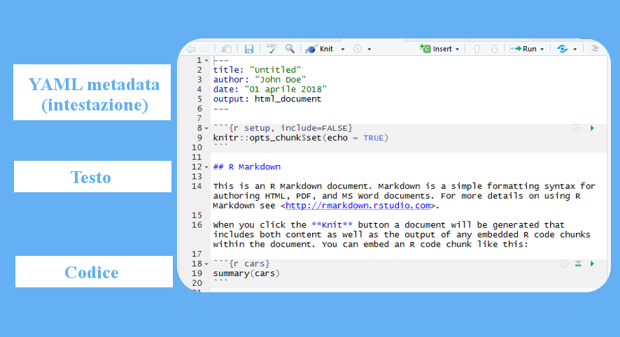
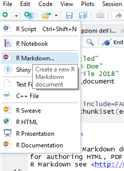

## Introduzione
### R, Markdown, R Markdown...?

Il tutorial non è scritto in aramaico antico e siamo tutti abbastanza intelligenti da associare una definizione ad un termine. Perciò facciamo un po' d'ordine:

* **R** è sia un _linguaggio di programmazione_<sup id="a1">[1](#f1)</sup> che un _ambiente di sviluppo_<sup id="a2">[2](#f2)</sup>

* **Markdown** è un _linguaggio di markup_<sup id="a3">[3](#f3)</sup>

* **R Markdown** è il nome del formato del file, con estensione .Rmd, su cui lavoreremo in RStudio

### File R Markdown

Un file .Rmd non è altro che un file di testo con al suo interno tre diverse tipologie di contenuti: 



1. Un'intestazione che fornisce le informazioni sul file e la sua struttura, necessarie durante la conversione da .Rmd ad altri formati (come vedremo più avanti). È racchiuso fra due stringhe di `---`

2. Semplice testo

3. Codice scritto in R<sup id="a4">[4](#f4)</sup>, racchiuso fra due stringhe di ` ``` `. Su Windows, questo carattere si ottiene utilizzando la combinazione di tasti `ALT` + `9` e `6` del tastierino numerico

Nel tutorial ci occuperemo di analizzare soltanto il primo di questi tre contenuti.

## Intestazione file R Markdown e sue opzioni
### Creare un nuovo file 

Diamo per scontato il settaggio della directory di lavoro e compagnia. Per creare un nuovo file .Rmd è possibile seguire due diversi metodi:

* Utilizzando la barra dei menù, seguendo il percorso _File_, _New file_ e selezionando l'opzione _R Markdown_


* Utilizzando la barra degli strumenti, cliccando sull'icona più a sinistra e scorrendo nel menù a tendina fino a selezionare l'opzione _R Markdown_



### Selezionare le opzioni di output (aka: che documento vogliamo)

Si apre una finestra ( _wizard_ ) che ci offre la possibilità di inserire il titolo del documento, il nome dell'autore e scegliere il formato in cui verrà convertito il file .rmd una volta finito di compilarlo. Comodo, piuttosto che scrivere tutto a mano (ma ci arriveremo...). Per ora ci occuperemo dei tre formati più semplici ed utilizzati:


### L'intestazione (o _header_)

Abbiamo già visto com'è fatto un file .rmd, occupiamoci finalmente dell'intestazione:


Cominciamo col dire che, sebbene RStudio dia in automatico la possibilità di inserirla, l'intestazione è una parte del file totalmente facoltativa: si può perciò cancellarla senza ripercussioni (_cosa che noi **NON** faremo_). 

#### Note
<i id="f1">1.</i> Ci vorrebbe un altro tutorial per spiegare cos'è e non è detto che a tutti interessi; in soldoni, si tratta di un linguaggio che definisice un set di regole che permette di interagire con una macchina ed ottenere da questa dei risultati. Non dite agli informatici che ho detto così o mi arrostiscono.[↩](#a1)

<i id="f2">2.</i> Stessa storia anche qui, potete pensarlo come un software che vi facilita la vita durante la scrittura del codice. Nel nostro caso, non usiamo R ma RStudio, molto più comodo.[↩](#a2)

<i id="f3">3.</i> Linguaggio basato su marcatori _(tags)_, serve a rappresentare la struttura di un testo: fa capire alla macchina qual è il titolo principale, quali sono gli elenchi, le tabelle e così via utilizzando i tags. Checché ne possiate pensare, markdown è uno dei linguaggi più _**semplici**_.[↩](#a3)

<i id="f4">4.</i> RStudio permette di lavorare con più di un linguaggio di programmazione.[↩](#a4)