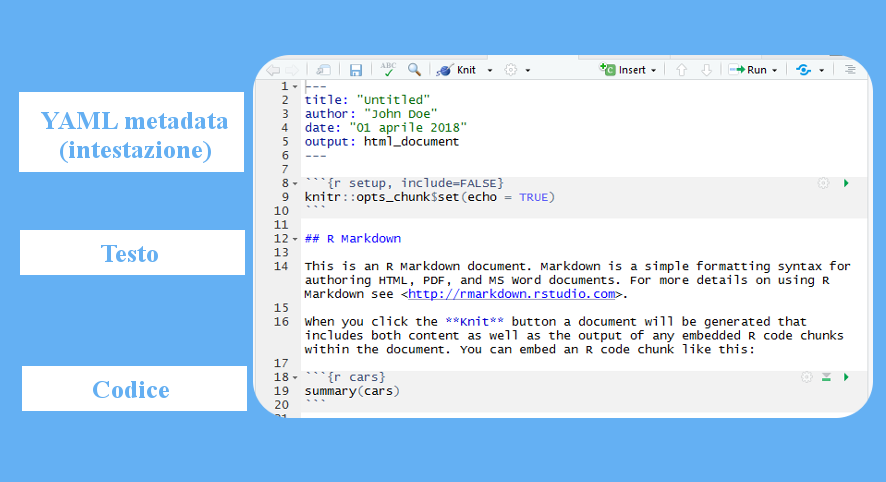
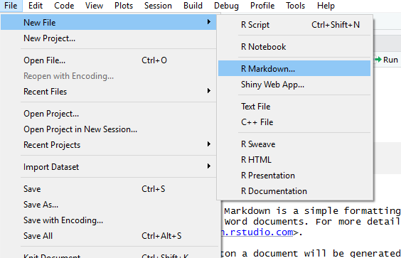
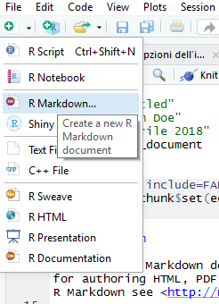
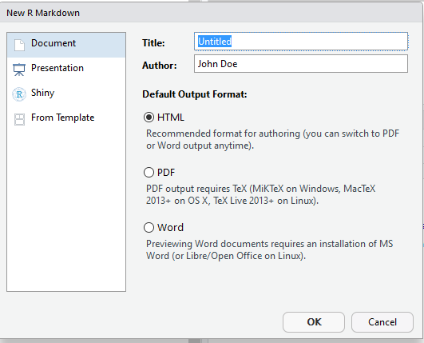
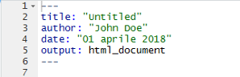

Markdown - Basics - Opzioni dell'intestazione
================

-   [Introduzione](#introduzione)
    -   [R, Markdown, R Markdown...?](#r-markdown-r-markdown...)
    -   [File R Markdown](#file-r-markdown)
-   [Intestazione file R Markdown e sue opzioni](#intestazione-file-r-markdown-e-sue-opzioni)
    -   [Creare un nuovo file](#creare-un-nuovo-file)
    -   [Selezionare il formato di output (aka: che documento vogliamo)](#selezionare-il-formato-di-output-aka-che-documento-vogliamo)
    -   [L'intestazione (o *header*)](#lintestazione-o-header)
    -   [Opzioni *(variables* o *arguments)* dell'intestazione](#opzioni-variables-o-arguments-dellintestazione)
-   [Approfondimenti](#approfondimenti)
    -   [Note](#note)

Introduzione
------------

### R, Markdown, R Markdown...?

Il tutorial non è scritto in aramaico antico e siamo tutti abbastanza intelligenti da associare una definizione ad un termine. Perciò facciamo un po' d'ordine:

-   **R** è sia un *linguaggio di programmazione*<sup id="a1">[1](#f1)</sup> che un *ambiente di sviluppo*<sup id="a2">[2](#f2)</sup>

-   **Markdown** è un *linguaggio di markup*<sup id="a3">[3](#f3)</sup>

-   **R Markdown** è il nome del formato del file, con estensione .Rmd, su cui lavoreremo in RStudio

### File R Markdown

Un file .Rmd non è altro che un file di testo con al suo interno tre diverse tipologie di contenuti:



1.  Un'intestazione che fornisce le informazioni sul file e la sua struttura, necessarie durante la conversione da .Rmd ad altri formati (come vedremo più avanti). È racchiuso fra due stringhe di `---`

2.  Semplice testo

3.  Codice scritto in R<sup id="a4">[4](#f4)</sup>, racchiuso fra due stringhe di ```` ``` ````. Su Windows, questo carattere si ottiene utilizzando la combinazione di tasti `ALT` + `9` e `6` del tastierino numerico

Nel tutorial ci occuperemo di analizzare soltanto il primo di questi tre contenuti.

Intestazione file R Markdown e sue opzioni
------------------------------------------

### Creare un nuovo file

Diamo per scontato il settaggio della directory di lavoro e compagnia (o, se preferite, fateci un tutorial voi). Per creare un nuovo file .Rmd è possibile seguire due diversi metodi:

-   Utilizzando la barra dei menù, seguendo il percorso *File*, *New file* e selezionando l'opzione *R Markdown*



-   Utilizzando la barra degli strumenti, cliccando sull'icona più a sinistra e scorrendo nel menù a tendina fino a selezionare l'opzione *R Markdown*



### Selezionare il formato di output (aka: che documento vogliamo)

Si apre una finestra *(wizard)* che ci offre la possibilità di inserire il titolo del documento, il nome dell'autore e scegliere il formato in cui verrà convertito nostro il file. Comodo, piuttosto che scrivere tutto a mano.



I file .Rmd supportano una serie diversa di formati, tra cui:

-   `html_document` - Documento html
-   `pdf_document` - Documento pdf
-   `word_document` - Documento di Microsoft Word (.docx)
-   `odt_document` - Documento di testo OpenDocument
-   `md_document` - Documento Markdown
-   `github_document` - Documento Markdown automaticamente convertito in HTML una volta caricato su GitHub

...e molti altri ancora. Questi sono solo quelli basilari.

### L'intestazione (o *header*)

Abbiamo già visto com'è fatto un file .Rmd, occupiamoci finalmente dell'intestazione:



Cominciamo col dire che, sebbene RStudio la inserisca di default, l'intestazione è una parte del file totalmente facoltativa: si può perciò cancellarla senza ripercussioni creando un file privo di header *(cosa che noi **NON** faremo ed il perché è presto detto)*

Nello [schema precedente](https://github.com/CBUFLM/RCourse_assignments#file-r-markdown) ci si è riferiti all'intestazione anche come "YAML metadata". Questo non perché vogliamo farci del male imparando degli scioglilingua ma perché formalmente l'intestazione non è altro che un blocco di metadati<sup id="a5">[5](#f5)</sup> scritti in YAML, Un linguaggio *human-friendly* per la serializzazione dei dati<sup id="a6">[6](#f6)</sup>.

La funzione dell'intestazione è infatti quella di fornire dei parametri per la conversione del file nel formato desiderato. Il *workflow* dell'intero processo richiede diverse trasformazioni (completamente automatiche) che sono riassunte nel seguente diagramma:


1.  Creazione del file .Rmd su RStudio
2.  Avvio della conversione
    -   Tramite console utilizzando la funzione [`render`](http://www.rdocumentation.org/packages/rmarkdown/versions/1.9/topics/render) della libreria <ins> *rmarkdown* </ins>
    -   Ancora più semplice, cliccando sul pulsante `knit`
3.  La libreria <ins> *knitr*</ins> legge i metadati, il testo ed esegue il codice scritto in R del file .Rmd convertendolo in un file .md
4.  Il file .md viene inviato a Pandoc, di fatto un convertitore universale di linguaggi di markup per generare quasi qualsiasi formato di file richiesto ([qui](http://pandoc.org/) per farvi un'idea di cosa è capace, basta solo guardare l'immagine per rimanerci...)

Seguendo la giusta sintassi, è possibile inserire manualmente più di un blocco di metadati e in qualunque parte del documento; l'unica accortezza sta nel separare il blocco dal resto del testo (o di codice) tramite una riga vuota. Ciò significa che il documento potrà avere due titoli? Ovviamente **no**. Se due blocchi tentano di definire valori diversi per lo stesso campo (es: *title*), il valore prescelto sarà quello del primo blocco.

### Opzioni *(variables* o *arguments)* dell'intestazione

Le opzioni offrono la possibilità di personalizzare, anche pesantemente, il proprio file. Partiamo con quelle predefinite offerte dal wizard:

-   **title**
    Il titolo che vorremo dare al documento. Il testo è racchiuso fra due `"`

-   **author**
    Qui inseriremo il nome dell'autore. Il testo è racchiuso fra due `"`. È possibile inserire più di un autore utilizzando la seguente formattazione:

<pre><code>---
author:
  - John Doe
  - Richard Roe
...</code></pre>
-   **date**
    RStudio recupera in automatico quella che il sistema considera la data attuale. Il testo è racchiuso fra due `"`. È possibile personalizzare la forma in cui viene visualizzata la data utilizzando la funzione `Sys.time()`nel seguente modo:

<pre><code>---
date: r format(Sys.time(), '%d, %B %Y')
...</code></pre>
Dove i simboli preceduti dal `%` seguono la seguente sintassi:

| Codice | Valore                                         |
|--------|------------------------------------------------|
| %d     | Giorno del mese (in formato numerico, 2 cifre) |
| %m     | Mese (in formato numerico, 2 cifre)            |
| %b     | Nome del mese (abbreviato)                     |
| %B     | Nome del mese (per esteso)                     |
| %y     | Anno (solo 2 cifre)                            |
| %Y     | Anno (per esteso, 4 cifre)                     |

-   **output**
    Abbiamo già esaminato [alcuni dei valori](https://github.com/CBUFLM/RCourse_assignments#selezionare-le-opzioni-di-output-aka-che-documento-vogliamo) da dare a quest'opzione. È possibile personalizzare ogni formato aggiungendo ulteriori opzioni; digitate nella console di RStudio il comando `?X_document` sostituendo ad *X* il nome del formato scelto (ad esempio `?html_document`). Le personalizzazioni vanno aggiunte come se fossero dei campi di secondo livello rispetto a quello di *output*:

<pre><code>---
output:
  github_document  
    toc: TRUE  
...</code></pre>
In questo caso è stata aggiunta l'opzione `toc`, *(table of content)*, con valore "TRUE": abbiamo appena abilitato la visualizzazione di un indice per il nostro file.

------------------------------------------------------------------------

Approfondimenti
===============

[Introduzione ad RMarkdown](https://rmarkdown.rstudio.com/lesson-1.html)  
[Struttura di un file RMarkdown](https://rmarkdown.rstudio.com/lesson-2.html)  
[Generalità sui blocchi di metadati (pandoc, YAML)](http://pandoc.org/MANUAL.html#metadata-blocks)  
[Output ed opzioni](https://rmarkdown.rstudio.com/lesson-9.html)  
[Qualche info sulla libreria *knitr*](https://yihui.name/knitr/)  
[Approfondimenti su *knitr* ed RStudio](http://kbroman.org/knitr_knutshell/pages/Rmarkdown.html)  
[Alcune delle opzioni più comuni generate da pandoc](http://pandoc.org/MANUAL.html#variables-set-by-pandoc)  
[Documento github (trovate anche gli altri formati di output cambiando il link)](https://rmarkdown.rstudio.com/github_document_format.html)  
[Date counting in informatica](https://en.wikipedia.org/wiki/System_time)  
[La data e il tempo su R (non solo nell'header)](https://www.stat.berkeley.edu/~s133/dates.html)  
[Interessante corso su R e Github (se non vi registrate consiglio di leggere le trascrizioni dei video)](https://www.coursera.org/learn/reproducible-templates-analysis)  

#### Note

<i id="f1">1.</i> Ci vorrebbe un altro tutorial per spiegare cos'è e non è detto che a tutti interessi; in soldoni, si tratta di un linguaggio che definisice un set di regole che permette di interagire con una macchina ed ottenere da questa dei risultati. Non dite agli informatici che ho detto così o mi arrostiscono.[↩](#a1)

<i id="f2">2.</i> Stessa storia anche qui, potete pensarlo come un software che vi facilita la vita durante la scrittura del codice. Nel nostro caso, non usiamo R ma RStudio, molto più comodo.[↩](#a2)

<i id="f3">3.</i> Linguaggio basato su marcatori *(tags)*, serve a rappresentare la struttura di un testo: fa capire alla macchina qual è il titolo principale, quali sono gli elenchi, le tabelle e così via utilizzando i tags. Checché ne possiate pensare, markdown è uno dei linguaggi più ***semplici***.[↩](#a3)

<i id="f4">4.</i> RStudio permette di lavorare con più di un linguaggio di programmazione.[↩](#a4)

<i id="f5">5.</i> O, rozzamente, *"dati dei dati"*: le informazioni riguardanti un determinato file che, normalmente, non trovate al suo interno. Per avere un esempio, su Windows cliccate con il tasto destro su un qualunque file, selezionate *Proprietà*, *Dettagli* e potrete farvi una chiara idea di cosa stiamo parlando.[↩](#a5)

<i id="f6">6.</i> A spanne, quella branca dell'informatica che si occupa della traduzione e "compressione" (passatemi il termine) dei dati (generalmente, *strutture di dati* e non dati elementari) in forme che possano essere archiviate o trasferite (esempio stupido: un file, *duh!*) [↩](#a6)
