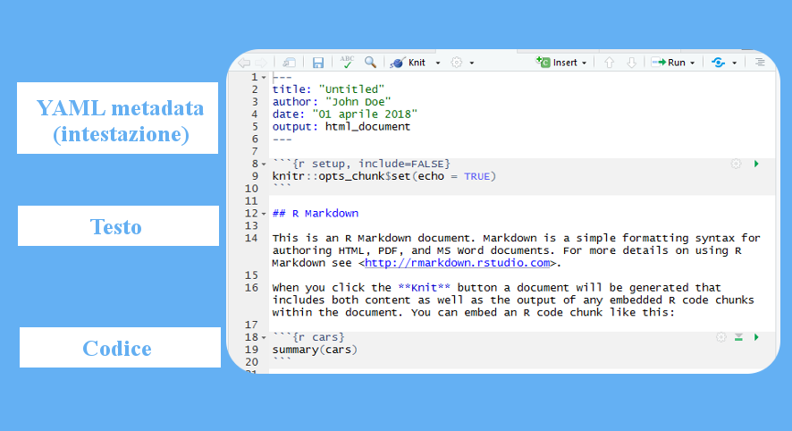

Markdown - Basics - Opzioni dell'intestazione
================

-   [Introduzione](#introduzione)
    -   [R, Markdown, R Markdown...?](#r-markdown-r-markdown...)
    -   [File R Markdown](#file-r-markdown)

Introduzione
------------

### R, Markdown, R Markdown...?

Il tutorial non è scritto in aramaico antico e siamo tutti abbastanza intelligenti da associare una definizione ad un termine. Perciò facciamo un po' d'ordine:

-   **R** è sia un *linguaggio di programmazione*[1](#f1) che un *ambiente di sviluppo*[2](#f2)

-   **Markdown** è un *linguaggio di markup*[3](#f3)

-   **R Markdown** è il nome del formato del file, con estensione .Rmd, su cui lavoreremo in RStudio

### File R Markdown

#### Note

<id="f1">1.</id> Ci vorrebbe un altro tutorial per spiegare cos'è e non è detto che a tutti interessi; in soldoni, si tratta di un linguaggio che definisice un set di regole che permette di interagire con una macchina ed ottenere da questa dei risultati. Non dite agli informatici che ho detto così o mi arrostiscono.

<id="f2">2.</id> Stessa storia anche qui, potete pensarlo come un software che vi facilita la vita durante la scrittura del codice. Nel nostro caso, non usiamo R ma RStudio, molto più comodo.

<id="f3">3.</id> Linguaggio basato su marcatori *(tags)*, serve a rappresentare la struttura di un testo: fa capire alla macchina qual è il titolo principale, quali sono gli elenchi, le tabelle e così via utilizzando i tags. Checché ne possiate pensare, markdown è uno dei linguaggi più ***semplici***.
